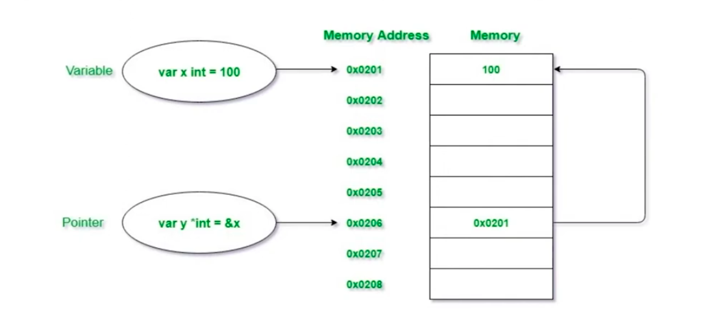

# Ponteiros
- go foi criado pensando em performance
- compartilhar valores entre as threads
- go trabalha com o conceito de ponteiros, ou seja, referencia de memória
- isso é interessante pois em determinados momentos, eu posso querer acessar o valore real da variável, em outros, posso querer apenas a "cópia" desse valor. Ou seja, posso modificar esse valor sem afetar a referência


## "Zero-values" e ponteiros em Go

- Tudo em Go recebe um valor 0 quando inicializado pela primeira vez
- Por exemplo, quando você cria uma string, o padrão é uma string vazia(""), a menos que você atribua algo a ela.
- Aqui estão todos os valores zero:
  - 0 para todos os tipos de int
  - 0,0 para float32, float64, complex64 e complex128
  - false para bool
  - "" para string
  - nulo para interfaces, slices, channesl, maps e funções
- Isso é o mesmo para ponteiros. Se você criar um ponteiro, mas não apontá-lo para nenhum endereço de memória, ele será nulo.

```go
package main

import "fmt"

func main() {
	var pointer *string
	fmt.Println(pointer) // nil
}

```

## Entendendo o funcionamento


```go
package main

import "fmt"

// trabalhando com ponteiros
func main() {
	var y int = 10
	var x *int = &y

	fmt.Println("endereço de y, armazenado em x: ", x) //0xc00000a0f8
	fmt.Println("valor de y, olhando para x: ", *x)    // 10
	fmt.Println("endereço de x: ", &x)                 //0xc000060060

	y = 15

	fmt.Println("novo valor de y, olhando para y: ", y)
	fmt.Println("novo valor de y, olhando para x: ", *x)
	fmt.Println("endereço de y, armazenado em x: ", x) //0xc00000a0f8
	fmt.Println("endereço de x: ", &x)                 //0xc000060060
}
```

## Exemplos


### Com pointeiros
```go
package main

import "fmt"

func main() {
	var x int = 100
	var y *int = &x // y aponta para x

	fmt.Println(x, y) // 100 0xc0000100f8
	fmt.Println(&x) // 0xc0000100f8
	fmt.Println(x, *y) // 100 100
}
```

### Sem ponteiros
```go
package main

import "fmt"

// trabalhando sem ponteiros
func main() {
	var y int = 10
	var x int = y

	fmt.Println("valor de y: ", y) // 10
	fmt.Println("valor de x: ", x) // 10

	y = 15

	fmt.Println("novo valor de y: ", y) // 15
	fmt.Println("valor de x: ", x)      // 10
}
```

```go
package main

import "fmt"

// exemplo com funções
func main() {

	var testValue string = "César"
	copyStringValue(testValue)
	fmt.Println("Fora da função copyStringValue: ", testValue)

	originalStringValue(&testValue)
	fmt.Println("Fora da função originalStringValue: ", testValue)
}

func copyStringValue(stringValue string) {
	stringValue = "TEST"
	fmt.Println("Dentro da função copyStringValue: ", stringValue)
}

func originalStringValue(stringValue *string) {
	*stringValue = "TEST"
	fmt.Println("Dentro da função originalStringValue: ", *stringValue)
}
```