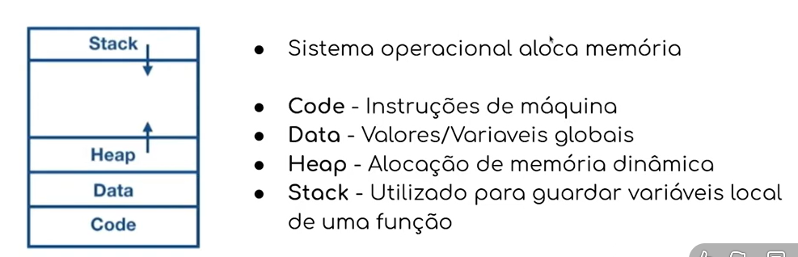
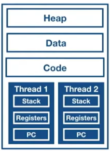
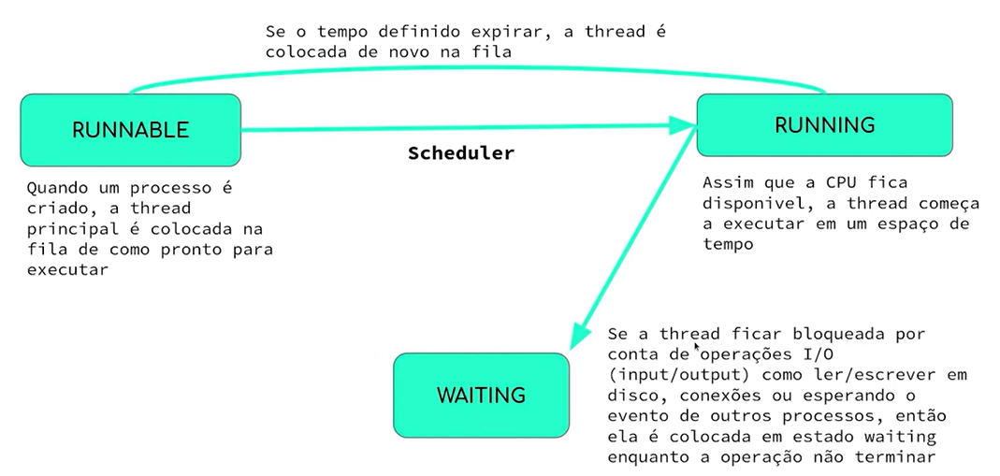
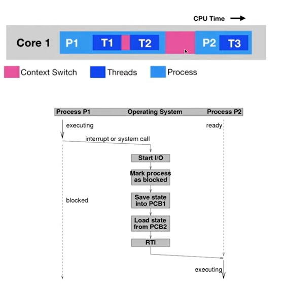

# Processos

## O que é um processo?

- um processo é a instancia de um programa rodando no sistema operaciomal
- um processo fornece ambiente para que um programa execute corretamente
- quando é necesário instaciar algum programa dentro do sistema, o sistema inicia um novo processo, que fornece recurso para esse programa ser execudado


## O que são as threads
- `Threads` são as menores unidade de execução que a CPU aceita(muito semelhante a implementação das goroutines)
- Cada processo tem no mínimo uma thread(que é a thread principal)
- Um processo pode ter várias threads
- Threads compartilham o mesmo espaço de endereçamento
- Threads executam uma independente da outra
- Threads podem rodar em concorrência ou paralelamente


## Estados de thread


## É possível dividir a aplicação em processos e thread para chegar a concorréncia, porém há limitações!!!

### Context Switching
- Para o sistema troca entre executar uma thread e executar a outra, há uma troca de contexto, que leva um tempo
- É mais eficiente usar um processo que contém várias thread do que vários processos com poucas thread, pois perde menos tempo com a mudança de contexto
- Porém isso pode causar um problema de multithread, conhecido como C10k problem


- go trabalha com o conceito de ponteiros, ou seja, referencia de memória
- isso é interessante pois em determinados momentos, eu posso querer acessar o valore real da variável, em outros, posso querer apenas a "cópia" desse valor. Ou seja, posso modificar esse valor sem afetar a referência

### C10K Problem
```go
package main

import "fmt"

// trabalhando com ponteiros
func main() {
	var y int = 10
	var x *int = &y

	fmt.Println("endereço de y, armazenado em x: ", x) //0xc00000a0f8
	fmt.Println("valor de y, olhando para x: ", *x)    // 10
	fmt.Println("endereço de x: ", &x)                 //0xc000060060

	y = 15

	fmt.Println("novo valor de y, olhando para y: ", y)
	fmt.Println("novo valor de y, olhando para x: ", *x)
	fmt.Println("endereço de y, armazenado em x: ", x) //0xc00000a0f8
	fmt.Println("endereço de x: ", &x)                 //0xc000060060
}
```

```go
package main

import "fmt"

// trabalhando sem ponteiros
func main() {
	var y int = 10
	var x int = y

	fmt.Println("valor de y: ", y) // 10
	fmt.Println("valor de x: ", x) // 10

	y = 15

	fmt.Println("novo valor de y: ", y) // 15
	fmt.Println("valor de x: ", x)      // 10
}
```

```go
package main

import "fmt"

// exemplo com funções
func main() {

	var testValue string = "César"
	copyStringValue(testValue)
	fmt.Println("Fora da função copyStringValue: ", testValue)

	originalStringValue(&testValue)
	fmt.Println("Fora da função originalStringValue: ", testValue)
}

func copyStringValue(stringValue string) {
	stringValue = "TEST"
	fmt.Println("Dentro da função copyStringValue: ", stringValue)
}

func originalStringValue(stringValue *string) {
	*stringValue = "TEST"
	fmt.Println("Dentro da função originalStringValue: ", *stringValue)
}
```